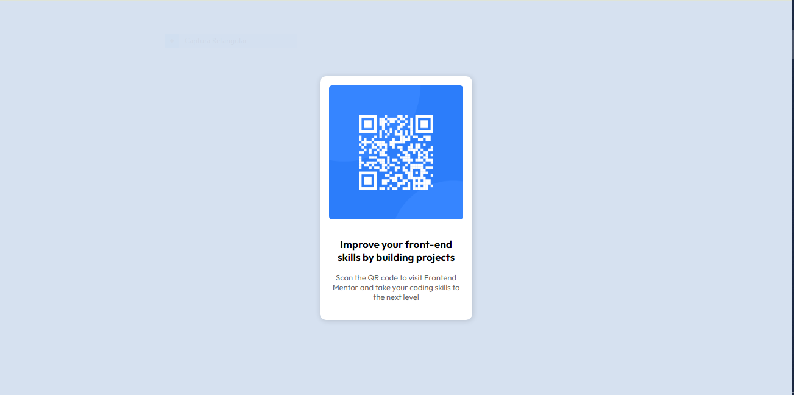

# Frontend Mentor - QR code component solution

This is a solution to the [QR code component challenge on Frontend Mentor](https://www.frontendmentor.io/challenges/qr-code-component-iux_sIO_H). Frontend Mentor challenges help you improve your coding skills by building realistic projects. 

## Table of contents

- [Overview](#overview)
  - [Screenshot](#screenshot)
  - [Links](#links)
- [My process](#my-process)
  - [Built with](#built-with)
  - [What I learned](#what-i-learned)
  - [Continued development](#continued-development)

**Note: Delete this note and update the table of contents based on what sections you keep.**

## Overview

### Screenshot

### Links

- Live Site URL: [Add live site URL here](https://teixeirabrenno.github.io/qrcode-project/)

## My process

- I started by analizing the content to see how many divs I would need and setting the semantics in the best way possible. The CSS was simple. I know this could have been done faster, but I managed to finish the project in about 30 minutes. 

### Built with

- Semantic HTML5 markup
- CSS custom properties
- Flexbox

### What I learned

This project was simple. The only part that I forgot how to do it was how to add the specified font to my project. However, I knew where to find the solution for it and got it done with no further issues.

### Continued development

Although this challenge was simple, I still struggle a little bit to organize things on the screen when there are a lot of elements to be dealt with. This was my first challenge at Frontend Mentor and I'm sure I will be able to practice and upgrade my skills with the next challenges. 

